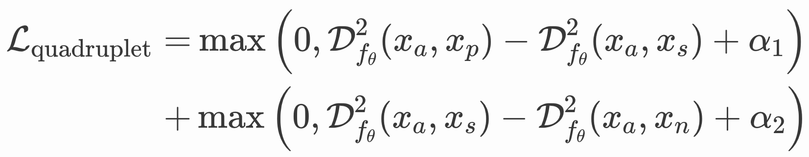

## [Deep Metric Learning: a (Long) Survey]((https://hav4ik.github.io/articles/deep-metric-learning-survey))
* Очень частые применения:
    - В картинках: распознавание лиц
    - В текстах: поиск по индексу
* Рассматривается конкретно Supervised Metric Learning.
* [Triplet Loss](https://arxiv.org/abs/1503.03832) (подробнее в [конспектах](papers.md)), [Triplet Loss and Online Triplet Mining in TensorFlow](https://omoindrot.github.io/triplet-loss).
* Проблемы триплета:
    - Майнинг (сложности со скейлингом)
    - Не настраивается вариативность внутри классов и между классами: не хотим крайних случаев (2 пересекающихся облака — ужасно, 2 сжатые в точку кучки — тоже ужасно)
* [Quadruplet Loss](https://arxiv.org/pdf/1704.01719.pdf): сам по себе работает не очень, но идейно решает вторую проблему: в первом слагаемом штрафуется чрезмерная близость объектов одного класса (и anchor сближается с первым позитивом), а во втором штрафуется уже близость к негативам (и anchor сближается со вторым позитивом):

* [Lifted Structured loss](https://arxiv.org/pdf/1511.06452.pdf): вместо отдельных пар и триплетов оптимизируется расстояние во всем микробатче (подробнее в [конспектах](papers.md)).