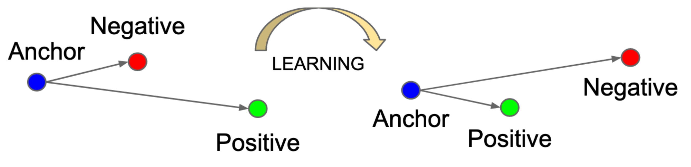
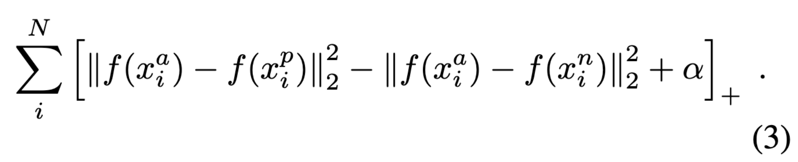
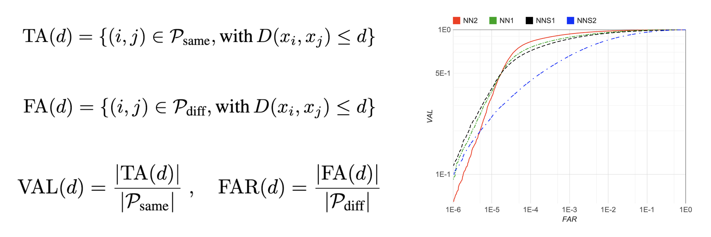
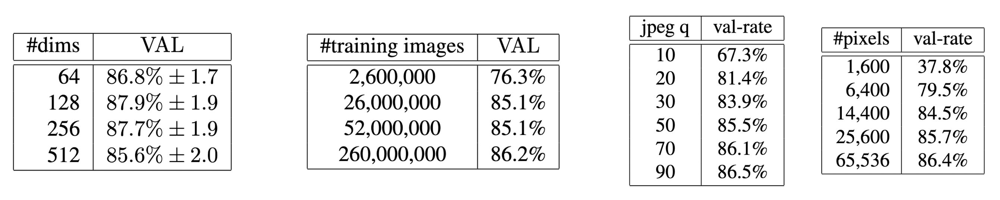
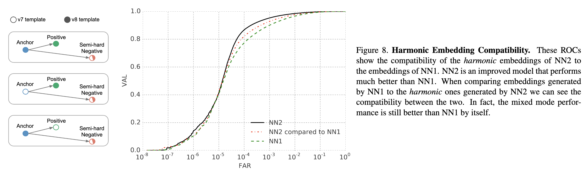
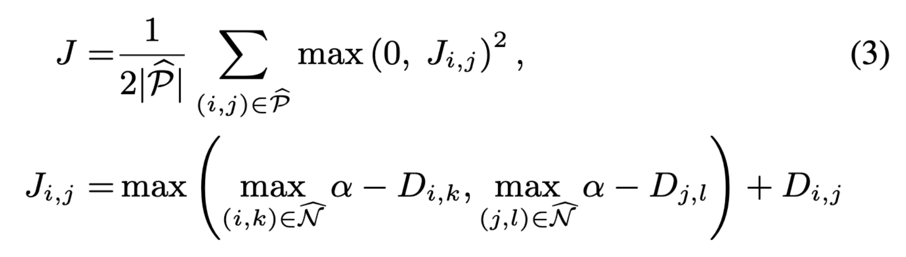
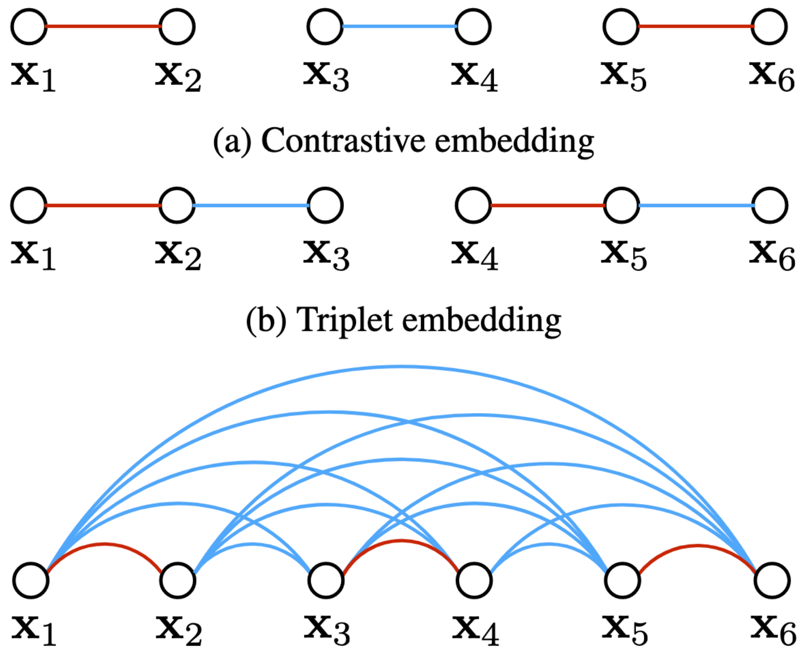
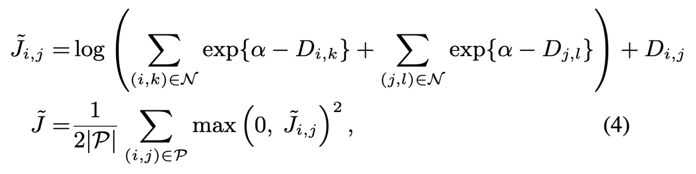
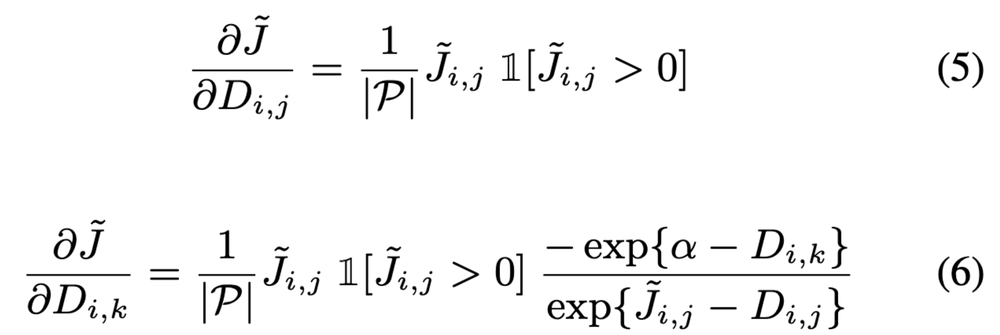
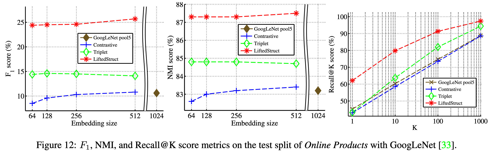

## [1503.0382](https://arxiv.org/abs/1503.03832) FaceNet: A Unified Embedding for Face Recognition and Clustering
* TL;DR — предложен триплет лосс *(хотя идея формулировалась и [ранее](https://papers.nips.cc/paper/2366-learning-a-distance-metric-from-relative-comparisons.pdf))*.

* Авторы **не** приводят сравнений с другими лоссами.

* Функционал **(3)** оптимизировать для случайных батчей очень легко *(существенная часть после нескольких шагов оптимизации становится easy negatives)*, поэтому сложность заключается именно в выборе триплетов. Авторы делают акцент не только на hard negative'ах, но и на hard positive'ах *(но впоследствии просто утверждают, что стабильнее использовать **все позитивы** + хард негативы).*
* Для решения проблемы авторы берут минимумы (максимумы) расстояний по минибатчу и используют в лоссе именно их. *Вообще, в работе предлагается не мало эвристик, но, к сожалению, нет ablation stdudy.* Также специально добавляются semi-hard negatives. Лучше работали большие батчи (1800 примеров, не более 40 позитивов per anchor).
* Датасеты для оценки: [Labeled Faces in the Wild](http://vis-www.cs.umass.edu/lfw/), [YouTube Faces](https://www.cs.tau.ac.il/~wolf/ytfaces/), а также неопубликованные. Предобработка: на вход сети подавался только фрагмент с лицом (в некоторых экспериментах использовался и проприетарный face detector), однако выравнивание не производилось.
* Авторы вводят свои метрики **(7)** VAL и FAR *(но фактически это TPR и FPR для всевозможных пар изображений)*:

* Достаточно ожидаемые результаты: размер эмбеддинга статистически не значим *(из исследованных, конечно)*, в отличие от размера обучающей выборки и качества изображений:

* Также авторы в приложении рассказывают об идее использовать разные модели при обучении эмбеддингов (*harmonic embeddings*), чтобы они были совместимыми. *Кстати, а ведь это можно использовать в дистилляции.* Впоследствии идея, похоже, почти не развивалась:

## [1511.06452](https://arxiv.org/pdf/1511.06452.pdf) Deep Metric Learning via Lifted Structured Feature Embedding
* TL;DR: предложен LSE-loss, честно сравнивается с contrastive pair и triplet loss.

* Есть исходный код: [github](https://github.com/rksltnl/Deep-Metric-Learning-CVPR16).

* Идея предложенного лосса **(3)** : строим связи внутри целого батча (как всегда: притягивая объекты одного класса и отдяляя объекты разных) — это следующий шаг после contrastive pair и триплета:

* Как читать лосс:
  1. Берем пару из одного класса `(i, j)` — сближаем
  2. Рассматриваем `i` в качестве anchor'а и ищем в других классах **самый** hard negative
  3. То же самое проделываем для `j`
  4. Из 2. и 3. выбираем более сложный hard negative — отдаляем
* Преимущество: в лоссе используется вся информация о микробатче (на самом деле не совсем).
* Преимущество лосса — утилизируется весь микробатч *(возможно, одни из первых)*.
* Проблемы: не дифференцируема и переусложненный майнинг. Первая проблема решается субградиентом, но утверждается, вложенные максимумы все равно приводят к плохим локальным оптимумам *(это не очевидно, но эксперименты не приводятся)*.
* Решения проблем классические: upper bound *(забавно, но тут тоже LSE)* + stochastic sampling **(4)**:

* На самом деле преимущество аппроксимации не только в оптимизации, но и в том, что для негативов градиент идет не по одному very hard семплу. Вместо этого фактически строится распределение hard'овости (градиент пропорционален софтмаксу отклонений) — красиво **(6)**:

* Рассматривают следующе развитие лоссов: Contrastive Embedding -> Triplet Embedding -> *Lifted Structured Embedding*
* Мотивация: extreme classification *(наконец нашелся термин)*.
* Собрали датасет: [Stanford Online Products Dataset](https://cvgl.stanford.edu/projects/lifted_struct/) — 120k картинок, 23k классов — один из наиболее крупных по количеству классов на тот момент; впоследствии использовался для сравнения различных ML-подходов.
* Эксперименты на задаче поиска и кластеризации. Также приводятся эксперименты на CARS-196 и CUB-200. Для всех датасетов половина классов была отправлена на обучени и половина на тест — для замера использовали [F1, NMI и Recall@k](https://nlp.stanford.edu/IR-book/html/htmledition/evaluation-of-clustering-1.html).
* Есть детали обучения (но непонятно, почему приводят размеры батча для contrastive и triplet, но не приводят для LSE).

* На трех рассмотренных задачах LSE был SOTA. Также для подтверждения результатов, кроме функционалов качества, авторы визуализируют t-SNE неизвестных модели классов (анализ ошибок тоже есть).